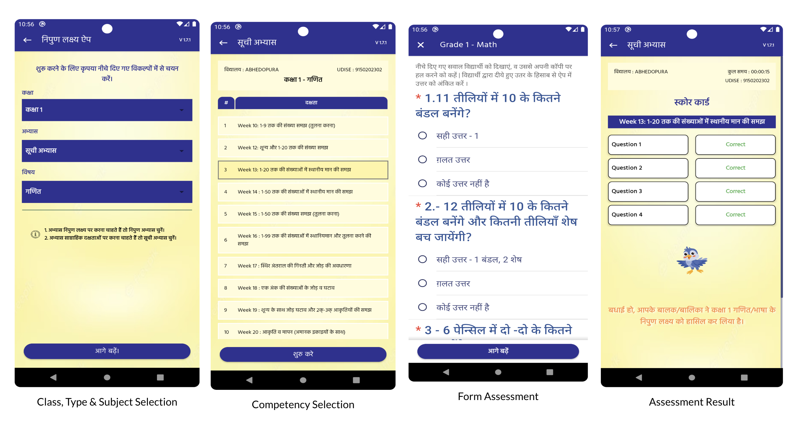

# निपुण लक्ष्य एंड्रॉइड एप्लिकेशन

#### [English](README.md)

निपुण लक्ष्य एंड्रॉइड एप्लिकेशन का उपयोग माता-पिता, शिक्षकों, परीक्षकों और सलाहकारों द्वारा किया
जाता है। इस ऐप के द्वारा माता-पिता और शिक्षक छात्रों को मूल्यांकन के लिए तैयार करने में मदद कर सकते
हैं। सलाहकार ऐप के द्वारा मूल्यांकन कर सकते हैं।

एप्लिकेशन मुख्य रूप से Kotlin में नए तत्वों के साथ Java में लिखा गया है। ऐप बड़े पैमाने पर
डेटा एकत्र करने के लिए ODK के Collect संस्करण का उपयोग करता है। ऐप आसान पहुंच और डेटा भंडारण के लिए
API
का उपयोग करता है। ऐप प्रमाणीकरण और पहुंच नियंत्रण के लिए हमारी बैकएंड सेवा से बात करता है।

## उद्देश्य

निपुण लक्ष्य ऐप राज्य और अभिनेताओं के लिए उनके
छात्रों की दक्षता का विश्लेषण करने के लिए एक थर्मामीटर है बुनियादी साक्षरता और संख्यात्मकता के आक्लन में। यह
एक प्रयास है भारत सरकार के
[निपुण भारत](https://nipunbharat.education.gov.in/) उद्देश्य की और।

## ऐप आंतरिक

* [ओडीके कलेक्ट](https://docs.getodk.org/collect-intro/)
* [हसूरा](https://hasura.io/)
* फायरबेस
* जेटपैक कंपोनेंट्स - ViewModel, LiveData
* Libraries - Retrofit, OkHttp, Realm, Rx
* भाषाएँ - Java, Kotlin, XML

## स्थापना

### 1. रेपो और सबमॉड्यूल को क्लोन करें

रेपो को क्लोन करें और सबमॉड्यूल को भी अपडेट करें
`git submodule update --recursive --remote`

### 2. एक NL बैकएंड इंस्टेंस सेटअप करें

ऐप बैकएंड सेटअप करने के
लिए [sandbox-deployment](https://github.com/Mission-Prerna/sandbox-deployment)
रेपो में दिए गए निर्देशों का पालन करें

**ध्यान दें: आप इस कदम को छोड़ सकते हैं और सीधे चरण 3.ए पर जा सकते हैं**

### 3. एक local.properties फ़ाइल बनाएँ

[sample.local.properties](/sample.local.properties) देखें और एक `local.properties` बनाएं।

आप चरण 2 में बनाए गए एंडपॉइन्ट्स के साथ क्रेडेंटिअल्स को प्रतिस्थापित कर सकते हैं।

#### 3.ए. सैंडबॉक्स एंडपॉइंट का उपयोग करें

हमने पूरे बैकएंड सिस्टम को तैनात करके एक सैंडबॉक्स बनाया है। आसान सेटअप के लिए
सैंडबॉक्स वातावरण का उपयोग करे। [sandbox.properties](/sandbox.properties) से local.properties में
डाटा कॉपी करें.

### 4. एक फायरबेस प्रोजेक्ट बनाएं

[फ़ायरबेस पर एक नया प्रोजेक्ट](https://console.firebase.google.com/project/_/settings/general)
बनाएं।

चरण 2 में "Enable Google Analytics for this project" को चुनना याद रखें।

#### 4.ए. एक प्रोजेक्ट google-services.json फ़ाइल बनाएं और रखें

1. उपरोक्त चरण में बनाए गए फायरबेस प्रोजेक्ट को खोलें।
2. पैकेज नाम `org.samagra.missionPrerna` के साथ एक एंड्रॉइड ऐप पंजीकृत करें
3. [डाउनलोड करें और रखें](https://support.google.com/firebase/answer/7015592?hl=en#android&zippy=%2Cin-this-article)
   `app` फ़ोल्डर में `google-services.json`।

#### 4.बी. एक odk google-services.json फ़ाइल बनाएं और रखें

1. उसी फायरबेस प्रोजेक्ट में एक और एंड्रॉइड ऐप जोड़ें
2. पैकेज का नाम `org.odk.collect.android` जोड़ें
3. `google-services.json` को डाउनलोड करें और `collect_app` फ़ोल्डर में रखें

### 5. ऐप चलाएं और वापस योगदान करें!

ऐप चलाएं, आनंद लें और [योगदान करें](./CONTRIBUTING.md)!

## सैंडबॉक्स पर क्रेडेंशियल्स का परीक्षण करें

आप हमारे सैंडबॉक्स परिवेश में ऐप द्वारा लॉगिन करने के लिए निम्नलिखित क्रेडेंशियल्स का
उपयोग कर सकते हैं

- शिक्षक - 9999999999
- परीक्षक - 9999999998
- मार्गदर्शक - 9999999997

उपरोक्त सभी परीक्षण उपयोगकर्ताओं के लिए ओटीपी को `9876` के रूप में दर्ज करें।

## बिल्ड का परीक्षण किया गया

* ओएस - macOS Ventura 13
* एंड्रॉइड स्टूडियो वर्जन - Android Studio Electric Eel | 2022.1.1 Patch 2
* एंड्रॉइड ग्रैडल प्लगिन वर्जन - v7.4.2
* ग्रैडल वर्जन - v7.5
* कोटलिन वर्जन - v1.6.21